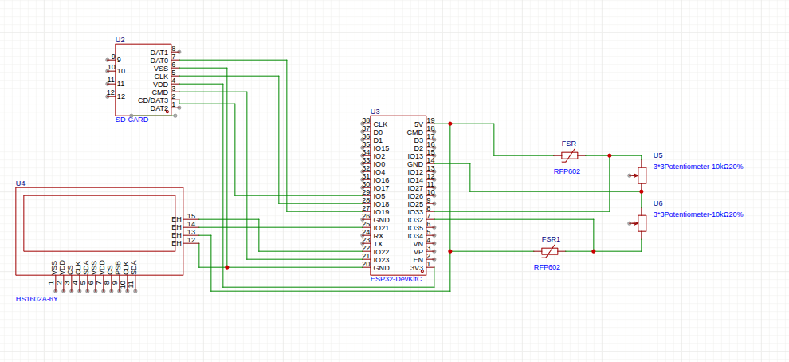

# FSR Force Sensor — ESP32 + Arduino Firmware
Firmware for a dual-channel force-sensing resistor (FSR) acquisition system, developed for measuring occlusal forces during clear aligner therapy. The repository contains three sketches split across two microcontrollers:
| File | Board | Features |
|------|-------|----------|
| `fsr_sd.ino` | ESP32 | SD logging + LCD display |
| `fsr_sd_ble.ino` | ESP32 | SD logging + LCD display + BLE notify |
| `servo_test.ino` | Arduino Uno | Automatic servo sweep (0°→90°→0°) for calibration setup |
| `servo_manual.ino` | Arduino Uno | Manual servo positioning via serial monitor |
 
---
 
## Circuit diagram
 

 
---
 
## Hardware
 
| Component | Model / Details |
|-----------|----------------|
| Acquisition MCU | ESP32 (3.3 V ADC, 12-bit) |
| FSR sensors | 2× Interlink RFP-602 |
| Display | 16×2 LCD with I²C backpack (address `0x27`) |
| Storage | MicroSD card module (SPI) |
| Calibration MCU | Arduino Uno (Elegoo R3) |
| Calibration actuator | Micro servo SG90 |
 

### ESP32 pin assignment
 
| Signal | GPIO |
|--------|------|
| FSR sensor 1 | 32 |
| FSR sensor 2 | 33 |
| SD chip select | 5 |
| LCD SDA / SCL | default I²C pins |
 
### Arduino pin assignment (calibration only)
 
| Signal | Pin |
|--------|-----|
| Servo signal (orange) | 3 (PWM) |
| Servo power (red) | 5 V |
| Servo ground (brown) | GND |

---
 
## Acquisition logic (ESP32)
 
- Readings are taken every **5 s** (configurable via `interval`).
- Each reading averages **10 ADC samples** (12-bit, 0–4095) with 5 ms between samples to reduce noise.
- The raw ADC value is inverted (`map(val, 0, 4095, 4095, 0)`) to match the physical response of the sensor: higher pressure → lower resistance → lower raw ADC → higher mapped value.
- Data are written to `/FSR_log.csv` on the SD card in append mode. A CSV header (`Time_s,SensorValue1,SensorValue2`) is written automatically if the file is empty.
- If an SD write fails, the error count is incremented and a reconnection attempt is made on the next cycle.
---
## BLE variant (`fsr_sd_ble.ino`)
 
The BLE variant additionally advertises a custom GATT service and sends a notify on each acquisition cycle.
 
| Parameter | Value |
|-----------|-------|
| Device name | `FSR_Sensor` |
| Service UUID | `4fafc201-1fb5-459e-8fcc-c5c9c331914b` |
| Characteristic UUID | `beb5483e-36e1-4688-b7f5-ea07361b26a8` |
| Property | NOTIFY |
| Payload format | `time_s,value1,value2` (ASCII CSV string) |
 
The device resumes advertising automatically after a client disconnects.
 
---
 
## Output file
 
`FSR_log.csv` on the SD card:
 
```
Time_s,SensorValue1,SensorValue2
5.00,2048,1983
10.00,2102,2010
...
```
> **Note:** `SensorValue1` and `SensorValue2` are raw (non-inverted) ADC counts as stored on the SD. The inverted values displayed on the LCD and sent over BLE are for real-time monitoring only.
 
---
 
## LCD display
 
```
12s  F1=2048
F2=1983  Err:0
```
 
Row 1 — elapsed time (s) and sensor 1 mapped value.  
Row 2 — sensor 2 mapped value and cumulative SD write error count.
 
---
 
## Sensor calibration (Arduino + SG90)
The SG90 servo mounted on an Arduino Uno was used to apply reproducible loads to the FSR surface during the calibration procedure. Two sketches are provided:
 
**`servo_test.ino`** — verifies the mechanical range before calibration. The servo sweeps from 0° to 90° in 5° steps and returns, printing the current angle to the serial monitor at each step.
 
**`servo_manual.ino`** — allows positioning the servo to any angle by sending an integer (0–180) over the serial monitor. Used to identify the contact angle at which the servo arm first touches the FSR surface.
 
The theoretical force applied at each step is estimated from the servo torque and lever arm length:
 
$$F = \frac{\tau}{r} \cdot \sin(\theta)$$
 
where τ = 0.0177 N·m (SG90 nominal torque at 5 V), *r* is the arm length from the servo axis to the contact point, and θ is the arm angle relative to horizontal. This approach yields an approximate calibration (uncertainty ±30–50 %) dominated by the manufacturer tolerance on the nominal torque.

---
 
## Dependencies
 
**ESP32 sketches** — install via the Arduino Library Manager:
 
- `LiquidCrystal_I2C` (Frank de Brabander)
- `ESP32 BLE Arduino` (included in the ESP32 Arduino core)
- Built-in: `SPI`, `SD`, `Wire`
**Arduino Uno sketches** — built-in only:
 
- `Servo` (included in the Arduino AVR core)
Select **Arduino Uno** in Tools → Board when uploading the servo sketches.
 
---
## Future work
 
- **Improved calibration:** replace the servo-based theoretical force estimation with a direct force measurement — e.g. a reference load cell (HX711 + 1 kg cell) or a calibrated kitchen scale placed beneath the FSR during the loading sweep. This would eliminate the ±30–50 % uncertainty associated with the nominal servo torque.
- **Characterisation under physiological conditions:** evaluate FSR response under humid conditions and after thermal immersion at 37 °C (simulating the oral environment during aligner therapy), to assess drift, sensitivity changes, and long-term stability of the sensor.
---

## Repository context
 
Developed as part of the doctoral thesis:
 
> *Thermoplastic materials for thermoformable clear aligners* — IMDEA Materials Institute / Universidad Carlos III de Madrid.
 


